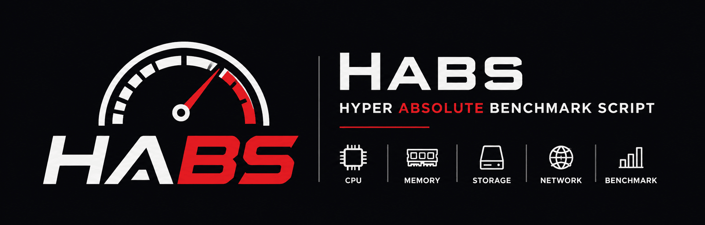

<p align="center">
  
</p>

<p align="center">
  
  
  
  
  
</p>

<p align="center">
  <b>HABS</b> — Hyper Absolute Benchmark Script<br>
  A professional Linux benchmarking suite combining <a href="https://github.com/masonr/yet-another-bench-script">YABS</a> and <a href="https://github.com/kdlucas/byte-unixbench">byte-unixbench</a><br>
  12 benchmark categories • Clean modern output • JSON export • Auto-dependency handling
</p>

---

## Table of Contents

- [Quick Start](#quick-start)
- [Usage](#usage)
- [Benchmarks](#benchmarks)
  - [Standard](#standard-benchmarks)
  - [Geekbench 6](#geekbench-6)
  - [Advanced](#advanced-benchmarks)
  - [y-cruncher](#y-cruncher)
  - [UnixBench](#unixbench-byte-unixbench)
- [Scoring](#scoring)
- [Output](#output)
  - [Terminal](#terminal)
  - [JSON](#json)
- [Requirements](#requirements)
- [Installation](#installation)
- [Comparison with YABS](#comparison-with-yabs)
- [Troubleshooting](#troubleshooting)
- [Contributing](#contributing)
- [License](#license)

---

## Quick Start

```bash
# Run directly (one-liner)
bash <(curl -sSL https://raw.githubusercontent.com/anjarman20/Hyper-Absolute-Benchmark-Script/main/habs.sh)

# Or download and run
curl -sSL https://raw.githubusercontent.com/anjarman20/Hyper-Absolute-Benchmark-Script/main/habs.sh -o habs.sh
chmod +x habs.sh
./habs.sh
```

> Running `./habs.sh` without any flags executes **all 12 benchmark categories**.

---

## Usage

```
Usage:  bash habs.sh [options]
```

### Options

| Option                | Description                                    |
|-----------------------|------------------------------------------------|
| `-h`, `--help`        | Show help message                              |
| `--version`           | Print version                                  |
| `--skip-cpu`          | Skip sysbench CPU benchmarks                   |
| `--skip-memory`       | Skip sysbench memory benchmarks                |
| `--skip-disk`         | Skip dd disk benchmarks                        |
| `--skip-network`      | Skip network benchmarks (curl + iperf3)        |
| `--skip-geekbench`    | Skip Geekbench 6                               |
| `--skip-advanced`     | Skip all advanced benchmarks (stress-ng, fio, multi-block mem, advanced net) |
| `--skip-y-cruncher`   | Skip y-cruncher Pi calculation                 |
| `--skip-unixbench`    | Skip UnixBench (byte-unixbench compilation)    |
| `--quick`, `-q`       | Quick mode — shorter tests, less data          |
| `--full`, `-f`        | Full mode — comprehensive tests                |
| `--json`              | Output results as JSON to stdout               |
| `--output FILE`       | Save results to file                           |
| `--no-color`          | Disable colored terminal output                |
| `--verbose`, `-v`     | Enable verbose/debug output                    |

### Examples

```bash
# Full benchmark suite (all 12 categories)
./habs.sh

# Quick overview
./habs.sh --quick

# Skip network tests on headless servers
./habs.sh --skip-network

# CPU + disk only
./habs.sh --skip-memory --skip-network --skip-geekbench --skip-advanced

# CPU + memory + Geekbench only
./habs.sh --skip-disk --skip-network --skip-advanced

# Export results as JSON for dashboards
./habs.sh --json --output results.json

# Silent JSON generation (suppress terminal output)
./habs.sh --skip-cpu --skip-memory --skip-disk --skip-network --skip-advanced --json 2>/dev/null | jq .
```

---

## Benchmarks

All benchmarks run by default. Use `--skip-*` flags to exclude.

### Standard Benchmarks

#### CPU

Uses **sysbench** to calculate events per second for prime number computation:

| Mode            | Configuration                        | Duration    |
|-----------------|--------------------------------------|-------------|
| Quick (`-q`)    | 1 thread + N threads, max-prime=10k  | ~15–30s     |
| Default         | 1 thread + N threads, max-prime=20k  | ~30–60s     |
| Full (`-f`)     | 1 thread + N threads, max-prime=50k  | ~60–120s    |

Scaling ratio (multi ÷ single) indicates how well the CPU utilizes multiple cores.

#### Memory

Sequential read and write throughput in MiB/s via sysbench (1M blocks):

| Mode            | Total Size                            |
|-----------------|---------------------------------------|
| Quick (`-q`)    | 2 GB                                  |
| Default         | 10 GB                                 |
| Full (`-f`)     | 20 GB                                 |

#### Disk

**dd** with direct I/O, bypassing caching:

| Test                  | Block Size | Default Size     |
|-----------------------|------------|------------------|
| Sequential Write      | 1 MiB      | 1 GB             |
| Sequential Read       | 1 MiB      | 1 GB             |
| 4K Write              | 4 KiB      | ~1 GB            |
| 4K Read               | 4 KiB      | ~1 GB            |

Auto-scales down when disk space is limited. IOPS calculated automatically.

#### Network

Downloads from four global CDN locations, reporting the best speed:

| Server                          | Provider     |
|---------------------------------|--------------|
| `speed.cloudflare.com`          | Cloudflare   |
| `cachefly.cachefly.net`         | CacheFly     |
| `proof.ovh.net`                 | OVH          |
| `speedtest.tele2.net`           | Tele2        |

- **Upload**: iperf3 to `iperf.he.net` / `iperf.online.net` / `iperf.scottlinux.com`
- **Latency**: ICMP ping to `1.1.1.1`, `8.8.8.8`, `cloudflare.com`

### Geekbench 6

Downloads the official Geekbench 6 CLI (~100 MB) from `cdn.geekbench.com` and runs the full benchmark suite:

| Metric          | Description                                    |
|-----------------|------------------------------------------------|
| Single-Core     | 25+ real-world workloads (AES, LZMA, JPEG, HTML5, SQLite, PDF, text processing, etc.) |
| Multi-Core      | Same workloads, all cores simultaneously       |

- Duration: **5–10 minutes**
- Architecture: x86_64 and ARM64 (Premium)
- Results parsed from JSON output
- Binary auto-cleaned after completion

### Advanced Benchmarks

#### Advanced CPU (stress-ng)

Uses **stress-ng** to measure bogo operations per second:

| Test       | Workload                     | Duration (default) |
|------------|------------------------------|--------------------|
| Matrix     | Matrix multiplication (256×256) | 20s             |
| FPU        | Floating-point operations    | 20s               |
| Crypto     | SHA256 / AES operations      | 20s               |
| Cache      | Cache thrashing              | 20s               |

#### Advanced Memory (sysbench multi-block)

Multi-block-size read test via sysbench:

| Block Size | Purpose                        |
|------------|--------------------------------|
| 256B       | L1 cache bandwidth             |
| 4K         | L2/L3 cache bandwidth          |
| 64K        | Cache-to-RAM bandwidth         |
| 1M         | Main memory bandwidth          |

#### Advanced Disk (fio + ioping)

**fio** — Random 4K Mixed, queue depth 32, 70/30 read/write mix, direct I/O:

| Metric              | Description                      |
|---------------------|----------------------------------|
| Read IOPS           | Random 4K read operations/sec    |
| Write IOPS          | Random 4K write operations/sec   |
| Read Latency        | Average read latency (µs)        |
| Write Latency       | Average write latency (µs)       |

Ioengine auto-detected: `io_uring` → `libaio` → `psync`

**ioping** — Measures actual disk response time in milliseconds.

#### Advanced Network

| Test          | Method                                   |
|---------------|------------------------------------------|
| IPv6 Download | curl via IPv6 to Cloudflare              |
| Packet Loss   | 10 × ICMP ping to `1.1.1.1`             |
| Traceroute    | Hop count to `1.1.1.1` (traceroute/mtr)  |

### y-cruncher

Pi calculation benchmark for CPU stability and performance:

| Config     | Digits     | Duration     |
|-----------|-----------|--------------|
| Quick      | 500M     | ~30–60s      |
| Standard   | 1000M    | ~1–3m        |
| Full        | 5000M    | ~5–20m       |

- Binary auto-downloaded per architecture (x86_64 / ARM64)
- Cleaned up after completion

### UnixBench (byte-unixbench)

Combined system index score from the classic UnixBench suite:

- Tests: Dhrystone, Whetstone, Execl, Pipe, Context Switching, Shell Scripts, System Call
- Compiles from source (requires gcc, make, perl)
- Reports single **System Benchmarks Index Score**

---

## Scoring

Scores are calculated on a **100-point scale** with five categories:

| Category      | Weight | Normalization Baseline     |
|---------------|--------|----------------------------|
| CPU           | 25 pts | 100 events/s single-thread  |
| Memory        | 25 pts | 2000 MiB/s read             |
| Disk          | 25 pts | 500 MB/s avg (1M r/w)       |
| Network       | 25 pts | 500 Mbps download            |
| Geekbench 6   | 25 pts | 500 single-core score        |

Each category is capped at 25 points. Total maximum is 125, normalized to 100.

### Letter Grades

| Score Range | Grade |
|-------------|-------|
| 97–100      | A+    |
| 90–96       | A     |
| 80–89       | A–    |
| 70–79       | B+    |
| 60–69       | B     |
| 50–59       | B–    |
| 40–49       | C+    |
| 30–39       | C     |
| 20–29       | D     |
| 0–19        | F     |

> Scoring is designed for relative comparison. Most meaningful when comparing similar system types.

---

## Output

### Terminal

Beautiful box-drawing terminal UI with color-coded sections:

```
  ┌─ System Information ────────────────────────────────────┐
   Hostname          : server-01
   OS                : Ubuntu 24.04 LTS (x86_64)
   Kernel            : 6.8.0-42-generic
   Architecture      : x86_64
   Virtualization    : kvm
   ...
  └──────────────────────────────────────────────────────────┘

  ┌─ CPU Benchmark ─────────────────────────────────────────┐
   Single:   1234.56 events/s
   Multi:    4567.89 events/s
   Scaling:  3.70x (ideal: 4x)
  └──────────────────────────────────────────────────────────┘

  ┌─ Results ───────────────────────────────────────────────┐
   CPU Score         : 21.3/25
   Memory Score      : 18.7/25
   Disk Score        : 15.2/25
   Network Score     : 22.1/25
   Geekbench Score   : 24.5/25

   Total Score       : 82/100
   Grade             : A-
  └──────────────────────────────────────────────────────────┘
```

### JSON

Full structured JSON output with all 12 benchmark categories:

```json
{
  "tool": "HABS",
  "version": "2.0.0",
  "timestamp": "2026-06-22T12:00:00Z",
  "system": {
    "hostname": "server-01",
    "os": "Ubuntu 24.04 LTS",
    "kernel": "6.8.0-42-generic",
    "architecture": "x86_64",
    "virtualization": "kvm",
    "cpu": { "model": "AMD EPYC 7713", "logical_cores": 8, "has_avx2": 1 },
    "memory": { "ram_total_bytes": 16506322944 },
    "storage": { "disk_total_bytes": 107374182400 },
    "network": { "ipv4": "203.0.113.1" }
  },
  "benchmarks": {
    "cpu": { "single_events_per_sec": 1234.56, "multi_events_per_sec": 4567.89 },
    "memory": { "read_mib_per_sec": 1095.67, "write_mib_per_sec": 576.89 },
    "disk": { "1m_read_mb_per_sec": 1234.5, "4k_read_iops": 1100 },
    "network": { "download_mbps": 456.78, "upload_mbps": 123.45, "avg_latency_ms": 12.34 },
    "geekbench_6": { "single_core_score": 1234, "multi_core_score": 5678 },
    "advanced_cpu": { "matrix_bogo_ops": 1234.56, "fpu_bogo_ops": 567.89 },
    "advanced_memory": { "256b_read_mib_per_sec": 12345 },
    "advanced_disk": { "fio_random_4k_read_iops": 45678, "ioping_latency_ms": 0.42 },
    "advanced_network": { "ipv6_download_mbps": 456.78, "packet_loss_pct": 0 },
    "y_cruncher": { "digits_millions": 1000, "compute_time_sec": 12.345 },
    "unixbench": { "index_score": 1234.5 }
  },
  "scores": { "cpu": 23, "memory": 18, "disk": 15, "network": 22, "geekbench": 24, "total": 82, "max": 100, "grade": "A-" }
}
```

Pipe through `jq` for pretty-printing: `./habs.sh --json 2>/dev/null | jq .`

---

## Requirements

| Tool        | Required | Used For                              | Auto-Install |
|-------------|----------|---------------------------------------|--------------|
| `sysbench` | Yes      | CPU, memory, advanced memory          | ✅           |
| `curl`      | Yes      | Network download, Geekbench download  | ❌ (pre-installed) |
| `dd`        | Yes      | Disk I/O benchmarks                   | ❌ (coreutils) |
| `ping`      | Yes      | Network latency, packet loss          | ❌ (pre-installed) |
| `python3`   | Yes      | JSON parsing (fio, iperf3, Geekbench) | ❌ (pre-installed) |
| `bc`        | Yes      | Arithmetic calculations               | ❌ (pre-installed) |
| `stress-ng` | Yes*     | Advanced CPU (matrix, FPU, crypto, cache) | ✅        |
| `fio`       | Yes*     | Advanced disk (random 4K QD=32)       | ✅           |
| `ioping`    | No       | Disk latency (advanced disk)          | ✅           |
| `iperf3`    | No       | Upload speed test                     | ✅           |
| `traceroute` | No      | Hop count (advanced network)          | ✅           |
| `gcc`/`make`/`perl` | No | UnixBench compilation           | ❌ (apt/yum) |

`*` Part of advanced benchmarks (skippable via `--skip-advanced`)

HABS auto-installs missing dependencies (`sysbench`, `stress-ng`, `fio`, `ioping`, `iperf3`, `traceroute`) via the system package manager when run as root.

---

## Installation

### One-liner (recommended)

```bash
bash <(curl -sSL https://raw.githubusercontent.com/anjarman20/Hyper-Absolute-Benchmark-Script/main/habs.sh)
```

### Manual

```bash
git clone https://github.com/anjarman20/Hyper-Absolute-Benchmark-Script.git
cd Hyper-Absolute-Benchmark-Script
chmod +x habs.sh
./habs.sh
```

### As a system command

```bash
sudo curl -sSL https://raw.githubusercontent.com/anjarman20/Hyper-Absolute-Benchmark-Script/main/habs.sh -o /usr/local/bin/habs
sudo chmod +x /usr/local/bin/habs
habs
```

---

## Comparison with YABS

| Feature                     | YABS                    | HABS v2.0                      |
|-----------------------------|-------------------------|--------------------------------|
| System Information          | Basic                   | Comprehensive (+ cache, flags, virtualization, load) |
| CPU Benchmark               | sysbench                | sysbench + stress-ng (4 tests) |
| Memory Benchmark            | ❌ Not included         | sysbench (1M) + multi-block    |
| Disk Benchmark              | dd (4K + 1M)            | dd + fio (QD=32, engine auto-detect) + ioping |
| Network Benchmark           | speedtest-cli / iperf3  | curl multi-CDN + iperf3 + IPv6 + packet loss + traceroute |
| Geekbench 6                 | ❌                      | ✅ Auto-download + run         |
| y-cruncher Pi               | ❌                      | ✅ 500M–5000M digit calculation |
| UnixBench                   | ❌                      | ✅ Compile from source + combined index |
| Scoring                     | Basic numeric           | Weighted 100-pt + letter grades |
| JSON Output                 | Limited                 | Full structured (all 12 categories) |
| Quick / Full Modes          | ❌                      | ✅                            |
| Box-drawing Terminal UI     | ❌                      | ✅                            |
| File Output                 | ❌                      | ✅ `--output FILE`            |
| Disk Space Awareness        | ❌                      | ✅ Auto-scaling               |
| Auto-Install Dependencies   | ❌                      | ✅ (6 tools across apt/dnf/yum/zypper/pacman/apk) |
| Architecture Support        | x86_64                  | x86_64 + ARM64 (aarch64)       |
| Line Count                  | ~500–600                | ~2080                          |

---

## Troubleshooting

### Geekbench 6 download fails

Ensure `curl` is installed and internet connectivity is available. Geekbench 6 downloads ~100 MB from `cdn.geekbench.com`. Use `--skip-cpu --skip-memory --skip-disk --skip-network` to run Geekbench alone and isolate network issues.

### stress-ng / fio installation fails

On minimal systems or when running without root, install manually:
```bash
# Debian / Ubuntu
apt-get install -y sysbench stress-ng fio ioping iperf3 traceroute

# RHEL / CentOS / Fedora
dnf install -y sysbench stress-ng fio ioping iperf3 traceroute

# Alpine
apk add sysbench stress-ng fio ioping iperf3 traceroute
```

### Disk benchmark is slow

WSL2, containers, and network filesystems exhibit lower I/O. The numbers reflect actual host capability under virtualization. Run `--full` on bare metal for accurate measurements.

### Network test times out

Some VPS providers block ICMP or specific CDN ranges. Use `--skip-network` or `--quick`.

### JSON output is blank

```bash
./habs.sh --json 2>/dev/null | jq .
```

All diagnostic messages go to stderr; stdout contains only the JSON.

### y-cruncher or Geekbench fail on ARM64

Ensure your system has sufficient memory (4 GB+ recommended). These benchmarks download multi-hundred-MB binaries — check disk space with `df -h`.

---

## Contributing

Contributions welcome! Please follow these guidelines:

1. **Fork** the repository
2. Create a **feature branch** (`feat/your-feature`)
3. Ensure **shellcheck** passes: `shellcheck habs.sh`
4. Test with both `bash -n habs.sh` and a full benchmark run
5. Submit a **pull request**

### Code Style

- `set -euo pipefail` strict error handling (already in place)
- `snake_case` for variables and functions
- `local` for all function-scoped variables
- Prefer POSIX-compatible tools where practical

---

## License

```
            DO WHAT THE FUCK YOU WANT TO PUBLIC LICENSE
                    Version 2, December 2004

 Copyright (C) 2004 Sam Hocevar <sam@hocevar.net>

 Everyone is permitted to copy and distribute verbatim or modified
 copies of this license document, and changing it is allowed as long
 as the name is changed.

            DO WHAT THE FUCK YOU WANT TO PUBLIC LICENSE
   TERMS AND CONDITIONS FOR COPYING, DISTRIBUTION AND MODIFICATION

  0. You just DO WHAT THE FUCK YOU WANT TO.
```
